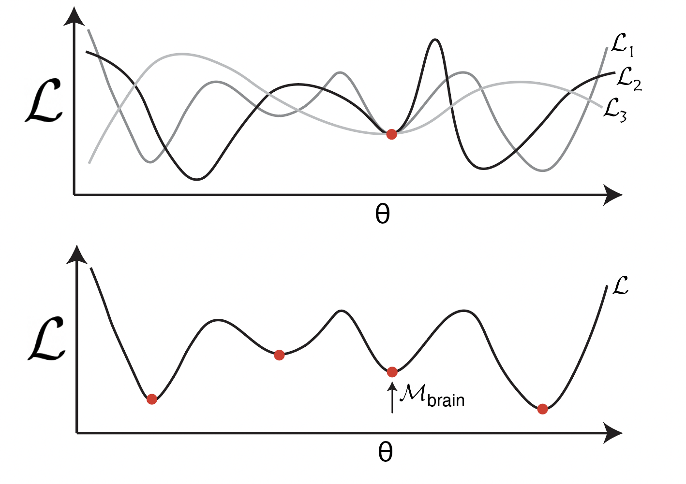

# No Free Lunch from Deep Learning in Neuroscience

Code corresponding to our [NeurIPS 2022 paper "No Free Lunch from Deep Learning in Neuroscience: A Case Study through Models of the Entorhinal-Hippocampal Circuit"](https://openreview.net/forum?id=syU-XvinTI1)

## Setup

### Virtual Environment

We recommend creating a virtual environment. One way to do this is by running the 
following sequence of commands:

`python3 -m venv mec_hpc_venv`

Then activate the virtual environment:

`source mec_hpc_venv/bin/activate`

Ensure pip is up-to-date:

`pip install --upgrade pip`

Then install the required packages:

`pip install -r requirements.txt`

Note: Some of the requirements' pinned versions have known security vulnerabilities and have since
been updated. We intentionally kept the outdated versions to ensure fair comparisons with previous
papers. Additionally, much code is vestigial (see Attribution below).

## Running

At a high level, our code is designed with two different phases in mind: training models at scale,
then analyzing trained models at scale.

### Training Models

We use [W&B](wandb.ai/) to run sweeps on our SLURM cluster. W&B sweep configurations are specified inside `sweeps/`,
and SLURM run scripts are inside `scripts/`. The Python entrypoint is `mec_hpc_investigations/models/run_trainer_rylan.py`.

### Analyzing Models

After training models, they can be analyzed in a 2 step process. First, use `scripts/run_eval_sweep.py`
to create files for analyzing a single model. Second, use the code inside `notebooks/` to answer
particular questions.

## Attribution

This repository was forked from [Nayebi et al. 2021's](https://proceedings.neurips.cc/paper/2021/hash/656f0dbf9392657eed7feefc486781fb-Abstract.html)
commit `dfaa3bc03eba9df8aace1541c0724482fbcab75e` on 2022/03/18.

## Contact

Questions? Comments? Interested in collaborating? Open an issue or 
email Rylan Schaeffer (rylanschaeffer@gmail.com) and cc Ila Fiete (fiete@mit.edu).
